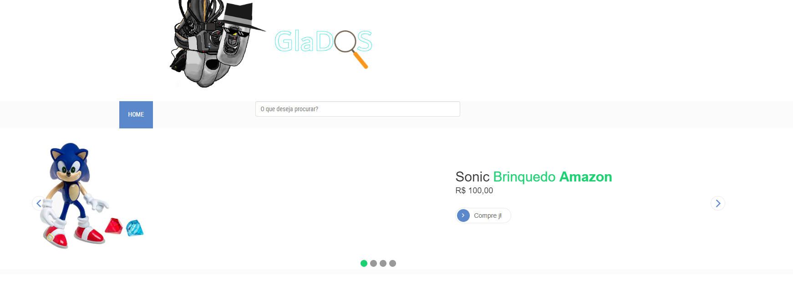
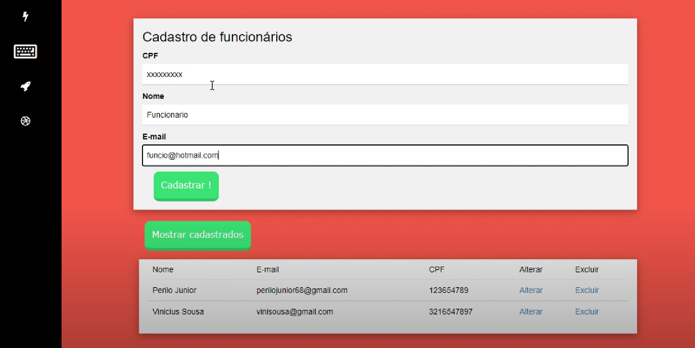

# **Vinícius Fernandes de Lima**

## Sobre mim :wave:

Meu nome é Vinicius, sou técnico em informática formado pelo Colégio Técnico Opção e atualmente faço o curso superior de "Tecnologia de Banco de Dados" na Fatec de São José dos Campos. No momento, trabalho como desenvolvedor full stack Angular e Spring Boot na empresa Alloc IT Solutions, atuando no desenvolvimento de uma solução tecnológica, voltada para a área comercial, que faz integrações com o ERP SAP. Estou nessa função desde abril de 2021, quando iniciei a minha carreira na área. Durante a minha trajetória, aprendi que há muito a ser desbravado e há sempre novos conhecimentos para serem absorvidos. Me afeiçoo bastante pelo desenvolvimento web e desejo continuar enriquecendo minhas capacidades por meio do contato intenso com livros, cursos, artigos e fóruns, sendo javascript um dos meus principais focos de estudo.

## Conhecimentos técnicos

* Java
* Spring Boot
* Oracle, MySQL, PostgresSQL, MongoDB
* Python
* Angular
* HTML
* CSS
* JavaScript
* C#

## Contato

* [Gitlab](https://gitlab.com/viniferlima)
* [Linkedin](https://www.linkedin.com/in/vinicius-fernandes-de-lima/)
* viniferlima0902@gmail.com

# **Meus projetos**

## Período 2019-2 | **[GlaDOS](https://gitlab.com/omnitron/glados)** 🤖 | Parceiro: Fatec

A proposta deste Projeto Integrador foi de caráter um tanto desafiador, no qual a solução foi fornecida, e a partir desta, os alunos deviam buscar um problema coerente.

A solução apresentada, que também pode ser entendida como requisito mínimo deste API, foi o desenvolvimento de um WEB Bot que deveria atender a uma demanda específica de um usuário final.

Com base nesta premissa, depois de algumas análises foi definida a ideia de construção de um buscador de preços no marketplace da Amazon, que tinha como finalidade buscar as melhores ofertas da plataforma e informar os percentuais de descontos, quando existissem. Portanto, agindo como um radar de preços, GlaDOS cumpria as seguintes tarefas:

* Busca de melhores preços em lojas virtuais;

* Cálculos e análises de percentuais de desconto;

* Comparação e acompanhamento de preços;

## Tecnologias utilizadas

- **Python:** Tecnologia utilizada para os requisitos funcionais prioritários do sistema por meio de suas bibliotecas (por exemplo: lxml e request) e do seu micro-framework flask. Com o Python se fez possível a raspagem de dados, que consiste em extrair dados de outro software, sendo neste caso o marketplace da Amazon.

- **Vue.js:** Responsável pela construção da interface gráfica, o framework Vue JS tornou a arquitetura da aplicação web mais organizada e o código mais legível, já que possibilita a reutilização de componentes; e também garantiu mais facilidade no seu uso, por meio de suas diretivas e eventos.

- **HTML:** Linguagem utilizada para estruturação da página web (marcação de texto).

- **CSS:** Linguagem que tem como função definir a estilização e todo o aspecto estético da página web.

- **JavaScript:** Linguagem de programação de uso geral, que neste projeto, foi usada para dar interatividade a pagina web.

- **MySQL:** Para armazenamento de informações do sistema, foi escolhido como sendo o banco de dados do projeto.

## Contribuições individuais

Neste projeto, o destaque da minha atuação como dev foi no front end, através da utilização do framework VueJs, possibilitando o desenvolvimento de componentes e a reutilização do código.

Na parte do BD, aprimorei meu conhecimento em comandos DDL e DML para criação e manipulação de dados. 

Além disso, foquei em auxiliar na elaboração de uma documentação clara e completa, a fim de agregar mais valor ao nosso produto final. Foi uma experiência marcante pois foi neste projeto que tive o primeiro contato com metodologias ágeis e com a própria ferramenta Git.

## Hard Skills

- **Metodologia Scrum:** Adquiri as primeiras noções dessa metodologia ágil, entendendo a importância da ideia de otimizar os recursos humanos e finalizar um projeto mais rápido, com melhor qualidade.

- **Git:** Aprendizado dos aspectos básicos em virtude do contato inicial.

- **HTML, CSS e JavaScript:** Foi a primeira experiência que me fez perceber, de fato, o papel de cada uma dessas ferramentas na construção de uma página web interativa: o HTML assumindo a função de estrutura, o CSS responsável pelo embelezamento e o JavaScript dando vida a aplicação web com as suas funções e eventos.

- **Vue JS:** Por meio do uso dessa ferramenta, conheci a facilidade que um framework do JavaScript pode trazer para o desenvolvedor quando se diz respeito a organização do código e praticidade.

## Soft Skills

- **Comunicação eficaz:** Tive que me acostumar a interação constante com o time. A cooperação foi fator presente do começo ao fim do projeto, o que proporcionou que as dúvidas fossem sanadas e os pensamentos alinhados, quando necessário.

- **Priorização:** Seguindo a noção de mínimo produto viável, foi necessário pensar logicamente para fazer entregas convincentes a fim de garantir a validação do produto pelo cliente. Portanto, a priorização de funcionalidades mais relevantes foi primordial para o planejamento como um todo.

## Período 2020-1 | **[Pineapple](https://gitlab.com/perilojunior68/visao-estrategica-de-projeto)** :pineapple: | Parceiro: Necto

Mudando a dinâmica do primeiro semestre, na qual eu e a minha equipe tínhamos a solução e precisávamos encontrar um problema, neste projeto tivemos como parceiro acadêmico a empresa Necto, que possuía o desafio de criar um gerenciador de projetos cujo planejamento deveria ser demonstrado através de um diagrama de Gantt.
Dado o desafio, nós desenvolvemos o sistema nomeado como "Pineapple", que foi pensado pra ser um sistema flexível, intuitivo e de fácil utilização conforme os requisitos da empresa Necto.
A aplicação tinha as seguintes funções:

- Gerenciamento de Projetos;

- Gerenciamento de Tarefas;

- Gerenciamento de Funcionários;

- Relatório de atividades.

## Tecnologias utilizadas

- **Java:** Com o auxílio de suas bibliotecas para criação de um projeto WEB, esta tecnologia foi utilizada para desenvolver regras de negócio do sistema.

- **Java Server Pages (JSP):** Este Framework é uma tecnologia que combina as linguagens de marcação HTML/XML e elementos da linguagem de programação Java, a fim de um conteúdo dinâmico e interativo em uma página WEB.

- **HTML:** Linguagem utilizada para estruturação da página web (marcação de texto).

- **CSS:** Linguagem que tem como função definir a estilização e todo o aspecto estético da página web.

- **JavaScript:** Linguagem de programação de uso geral, que neste projeto, foi usada para dar interatividade a pagina web.

- **Bootstrap:** É um framework front-end que fornece estruturas de CSS para a criação de sites e aplicações responsivas de forma rápida e simples.

- **MySQL:** Para armazenamento de informações do sistema, utilizado para ser o banco de dados do projeto.

- **Gradle:** É um sistema de automação de builds. Oferece uma maneira flexível de compilar, criar e empacotar dependências do Java.

## Contribuições individuais

Neste projeto, tive a missão de participar do desenvolvimento da interface gráfica da aplicação, mais uma vez atuando como dev e auxiliando na criação dos formulários de cadastro das entidades e no layout do gráfico de Gantt. Também fui responsável pela escolha do template utilizado no sidebar (menu lateral), na descrição dos requisitos e poucas ocasiões lidei com o back end (Java). Foi um projeto que exigiu bastante comprometimento de mim e da minha equipe. Em alguns momentos, houve interpretações distoantes entre os membros da equipe, portanto foi necessário uma boa comunicação  e resiliência para sanar todas as dúvidas que surgiam durante todo o percurso até a sprint final.

## Hard Skills

- **Java:** Apesar de já ter tido um raso contato com esta linguagem anteriormente, foi um grande desafio lidar com a sintaxe verborrágica do Java. Entretanto, esta experiência foi fundamental para eu me familiarizar com a linguagem. Além disso, também houve contatos iniciais com os conceitos de orientação a objetos e com a IDE Eclipse.

- **Programação Orientada a Objetos (P.O.O):** Neste período tive um vislumbre inicial deste paradigma de progração que auxilia na organização, interpretação e reuso do código.

- **Java Server Pages (JSP):** Com o uso desta ferramenta, é possível escrever HTML com códigos JSP embutidos, trazendo mais dinamismo a pagina web. Também tive o primeiro contato com o servlet-container tomcat. 

- **Heurísticas de Nielsen:** Neste período foi estudado as 10 Heurísticas de Nielsen que viabilizam uma interface mais intuitiva e sugestiva para o usuário. No sistema desenvolvido foi aplicado pelo menos 4 Heurísticas sendo elas: Usabilidade, Flexibilidade, Design minimalista e Reconhecimento.

## Soft Skills

- **Persistência:** Foi necessário ter paciência para compreender os conceitos do Java, o funcionamento de requisições HTTP e o papel do client side e server side na prática. Em resumo, foi preciso respeitar a minha própria curva de aprendizado para absorver esses conhecimentos. 

-  **Atitude Positiva:** Foi necessário manter-se motivado, otimista, focado nas possibilidades reais e mais nos acertos do que nos erros. Tentei sempre expor uma postura contagiante diante da equipe, ajudando da melhor forma.

## Período 2020-2 | **[Semáforo do Consumidor](https://github.com/felipemessi/portifolio-fatec/tree/main/2020-2_SemaforoConsumidor)** :traffic_light: | Parceiro: SPC

Em parceria com o SPC Brasil, foi proposto o desenvolvimento de uma ferramenta que serviria de complemento para o sistema Cadastro Positivo. Com o desafio proposto, realizamos o desenvolvimento da ferramenta do Semáforo do consumidor, que tinha como propósito estimular toda a cadeia de consumo de forma consciente, estimulado aqueles que estão com uma situação financeira instável a conseguir sua independência financeira; para aqueles que estão confortáveis financeiramente, são dedicados incentivos ao consumo com qualidade e com as melhores condições; e para empresas parceiras, é passado o direcionamento de consumidores qualificados, aumentando consequentemente, o índice de vendas e comissões.

## Tecnologias utilizadas

- **Java:** Principal linguagem que montou toda a estrutura que possibilitou codificar as regras de negócio.

- **Docker:** Oferece a capacidade de empacotar e executar um aplicativo em um ambiente isolado denominado container. O isolamento e a segurança permitem que você execute vários containers simultaneamente em um determinado host.

- **Postgres SQL:** Usado para armazenar os dados da aplicação, o PostgreSQL é um sistema gerenciador de banco de dados objeto relacional, desenvolvido como projeto de código aberto.

- **HTML:** Linguagem utilizada para estruturação da página web (marcação de texto).

- **CSS:** Linguagem que tem como função definir a estilização e todo o aspecto estético da página web.

- **JavaScript:** Linguagem de programação de uso geral, que neste projeto, foi usada para dar interatividade a pagina web.

## Contribuições individuais

Como dev, neste projeto eu participei da criação do layout do sistema, ajudando no uso do template Bootstrap nos formulários, na tela de login e no menu de navegação principal. Tendo em vista os projetos anteriores, existiu um desafio inédito: as decisões relativas ao sistema eram pautadas na Lei Geral de Proteção de Dados (LGPD), o que exigiu muitas pesquisas e discussões constantes com a minha equipe.

## Hard Skills

- **Bootstrap:** Realizei ajustes de layout por meio templates com regras CSS pré estabelecidas. Aprendi melhor noções de alinhamento, espaçamento e redimensionamento dentro do CSS. 

- **Wireframes:** Os wireframes serviram para auxiliar na estruturação e validação de ideias para a interface gráfica. É uma boa técnica para encontrar a identidade visual de um website, com o uso de protótipos.

- **Docker:** Aquisição de alguns comandos básicos no docker, como execução de containers e gerenciamento de volumes. 

## Soft Skills

- **Flexibilidade:** Foi necessário ser versátil para conseguir assimilar todos os novos conceitos, realizar as tarefas impostas e colaborar da melhor forma com a minha equipe na qual eu tinha ingressado de última hora e desconhecia todos os integrantes.

- **Colaboração:** Por mais que eu fosse o integrante com menor experiência profissional, tentei me mostrar interessado e focado em ajudar o meu time da melhor forma possível, dentro das minhas capacidades.

## Período 2021-1 | **[PythaOn](https://gitlab.com/gurst6/projeto-integrador-pythaon)** :on: | Parceiro: Jetsoft

No primeiro semestre de 2021, a premissa do projeto foi desenvolver uma solução parametrizável que combine diversos critérios, para busca de candidatos em diferentes vagas com diferentes recrutadores, propondo um processo eficiente para a contratação e evasão de funcionários, reduzindo assim, custos e aumentando a satisfação com alocações mais adequadas. A minha equipe visou criar um sistema para a otimização e que facilite o processo de contratação de novos colaboradores, tendo como foco a rapidez e agilidade nos procedimentos.

Em suma, o projeto possui as seguintes funções:

- Gerenciamento de vagas;

- Gerenciamento de candidatos;

- Busca por vagas com diferente critérios;

- Busca por candidatos com perfil da vaga;

## Tecnologias utilizadas

- **Python:** Principal linguagem que possibilitou a criação das regras de negócio do sistema. Por meio de suas bibliotecas foi possível estruturar a nossa API.

- **Django:** É um framework para desenvolvimento rápido para web, escrito em Python, que utiliza o padrão Model-View-Controller (MVC). Permite a criação de processos muito otimizados.

- **Mongo DB:** Banco de dados não relacional orientado a documentos utilizado para armazenar os curriculos e as vagas disponiveis; Suas ferramentas de geolocalização auxiliaram em uma das principais funções do projeto.

- **Postman:** É uma ferramenta que dá suporte à documentação das requisições feitas pela API. Ele possui ambiente para a documentação, execução de testes de endpoints e requisições em geral.

## Contribuições individuais

Neste projeto ocorreu uma mudança positiva, pois passei a integrar um grupo cuja relação me agradou bastante. Tivemos uma boa dinâmica, o que facilitou para a criação de um projeto íntegro e um desenvolvimento bem fluído. Em relação as atribuições que tive no decorrer do projeto, exercendo o papel de dev, colaborei na criação e gerenciamento do banco de dados MongoDB. Foi a primeira experiência com um banco de dados não relacional e com o Atlas, sendo bastante enriquecedor para o meu conhecimento, merecendo destaque para o uso dos operadores geoespaciais para determinar distâncias e coordenadas ($maxDistance, $geometry e etc); por meio de cálculos de distância, foi possível constatar quais contratados são mais adequados para receber pagamento de vale transporte, ou caso a distância fosse muito curta, era feita a abstenção desse benefício.

## Hard Skills

- **Mongo DB:** Neste projeto tive a oportunidade de aprender esta nova ideia banco de dados orientado a documentos. Além da instalação e utilização também aprendi as vantagens, desvantagens e características deste banco de dados não relacional.

- **API:** São mecanismos que permitem que dois componentes de software se comuniquem usando um conjunto de definições e protocolos. Dentro deste conceito, fui capaz de compreender o mecanismo de diálogo existente entre o front e o back end, por meio de requisições HTTP que são usadas para acessar os dados do servidor (GET, POST, PUT, DELETE, etc).

## Soft Skills

- **Diligência:** Eu e minha equipe tivemos que ter muito zelo e cuidado para entregar uma solução que tivesse um bom ganho de performance em relação ao acesso de grande volume de dados (vagas, contratados, etc). Esse banco dados foi escolhido por conta do alto desempenho com grandes volumes de dados, pela flexibilidade com documentos em formato JSON e pela fácil integração com Python.

- **Comunicação eficaz:** Passei a integrar este novo grupo e me empenhei para estabelecer uma comunicação clara, eficaz e amigável com os demais integrantes.

## Período 2021-2 | **[PythaOff](https://gitlab.com/gurst6/pythaoff-ness)** :no_mobile_phones: | Parceiro: Ness

Neste período, foi proposto o desafio de desenvolver uma solução de dados voltada para o ensino a distância, neste contexto foi criada a aplicação Pythaoff. O sistema deveria promover uma gestão para instituições de ensino, a partir de um outro projeto já desenvolvido por outra equipe de API em semestres anteriores. Afim de atingir os objetivos de gestão, o sistema deveria contemplar alguns relatórios, utilizando a tecnologia de DataWarehouse e um modelo OLAP para visualização e análise de dados. De maneira breve, é pertinente descrever os relatórios solicitados da seguinte forma: 

- Engajamento: quais alunos/colaboradores estão fazendo o curso no qual estão matriculados;

- Participação x taxas de conclusão x desempenho dos alunos/colaboradores;

- Desempenho: qual o aproveitamento (nota atingida) no curso matriculado;

- Avaliação de reação (feedback): qualificação do conteúdo apresentado, experiência do aluno/colaborador durante o curso;

- Acompanhamento do tempo de participação no curso: tempo online executando as atividades;

- Registro de chats e logs;

## Tecnologias utilizadas

- **Python:** Linguagem de programação usada para construir o back-end da aplicação.

- **Django:** É um framework para desenvolvimento rápido para web, escrito em Python, que utiliza o padrão Model-View-Controller (MVC). Permite a criação de processos muito otimizados.

- **SQL:** Linguagem usada para executar comandos em bancos de dados relacionais.

- **Selenium:** O Selenium é uma ferramenta utilizada para automatização de testes de sistemas que permite ao usuário reproduzi-los rapidamente no ambiente real da aplicação, em função da sua integração direta com o navegador.Foi usado para a criação do script de automação para o Webbot coletar os dados na Web;

- **Gradle:** É um sistema avançado de automatização de builds.

- **Power BI:** É uma ferramenta da Microsoft voltada para a apresentação de informações através da criação de painéis e dashboards. Foi a ferramenta de OLAP para exibir os dados persistidos no banco de dados.

- **Pentaho:** Ferramenta utilizada para realizar o processo de ETL no banco de dados.

## Contribuições individuais

Neste projeto, fiquei com a missão de desenvolver uma interface gráfica intuitiva e apresentável contendo os painéis e dashboards, de forma que fossem exibidos os dados persistidos no banco de dados. Houve uma certa indecisão na escolha da ferramenta/linguagem a ser usada na construção do layout da aplicação, sendo que inicialmente fizemos esboços com Angular e Vue Js. Após alguns protótipos, desenvolvemos toda a interface gráfica do utilizador com o Power BI, o que nos trouxe muita facilidade para estabelecer conexão com o banco de dados e para realizar os cálculos necessários para montar os gráficos, contadores e afins.

## Hard Skills

- **Power BI:** Aquisição de noções gerais da ferramenta, tais como, criar visualizações, dashboards, relatórios e a alimentá-los com conjuntos de dados.

- **Angular:** Apesar de não ter sido a escolha final para o desenvolvimento do front-end do projeto, por um longo tempo de trabalho, esse framework do JavaScript foi utilizado. Foi tempo suficiente para ter contato com as suas diretivas, pipes, atributos e até mesmo algumas bibliotecas JavaScript que fornecem recursos para montagem de gráficos, podendo citar o ApexCharts.js e Chart.js.

## Soft Skills

- **Persistência:** Foram feitas muitas alterações na interface gráfica ao decorrer do projeto, sendo que em duas ocasiões diferentes a ferramenta em questão fora substituída. Foi necessário persistir até encontrar o layout que mais agradasse o cliente final em um curto espaço de tempo.

- **Organização:** A missão de cada integrante foi bem definida pelas capacidades individuais e afinidades de cada um, definindo quem era a escolha ideal para cada função. 

